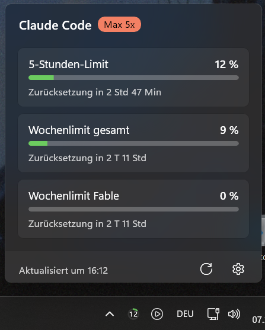

# AI Usage

Windows 11 tray app that shows your Claude Code usage limits (5-hour and weekly windows) as a ring gauge in the notification area, with a flyout for details.

## Install

1. Install the [Windows App Runtime 2.x](https://learn.microsoft.com/windows/apps/windows-app-sdk/downloads) (x64) if you don't have it yet. If it is missing, the app shows a dialog with a download link at startup.
2. Download `AIUsage-<version>-setup.exe` from the [latest release](https://github.com/marco-kretz/AIUsage/releases/latest) and run it. It installs per user (no admin rights) to `%LOCALAPPDATA%\Programs\AIUsage` and adds a Start menu entry. The setup is not code-signed, so Windows SmartScreen may warn about an unknown publisher (*More info → Run anyway*).

Prefer no installer? Extract `AIUsage-<version>-win-x64.zip` to any folder and start `AIUsage.exe`.

You need to be signed in to [Claude Code](https://claude.com/claude-code) with a Claude subscription. The app reads the existing login from `%USERPROFILE%\.claude\.credentials.json`.

New tray icons land in the overflow area. Pin it via *Settings → Personalization → Taskbar → Other system tray icons* or by dragging it onto the taskbar.

To update, run the new setup. To uninstall, use *Settings → Apps*; settings and logs stay in `%LOCALAPPDATA%\AIUsage\` until you delete that folder. With the zip, turn off *Start with Windows* and delete the folder.

## Usage

- Left click: toggle flyout. Esc or clicking elsewhere closes it.
- Right click: *Refresh now*, *Settings …*, *Start with Windows*, *Exit*.
- Icon: highest percentage of the selected windows. Green below 50 %, orange from 50 %, red from 80 % (both configurable). `?` means loading, `!` means an auth/network error, and a dimmed icon means the values are stale.
- Settings: poll interval, thresholds, which windows drive the icon, notifications at 80 % / 95 %, language (German/English).

## Privacy

The app sends your Claude Code token only to `api.anthropic.com` to fetch the usage numbers, at most every 3 minutes. It never refreshes or logs the token and has no telemetry. Settings and logs (kept for 7 days) live in `%LOCALAPPDATA%\AIUsage\`.

## Limitations

- The usage endpoint is undocumented and may change or stop working at any time.
- Only Claude Code for now; Windows 11 x64 only.

## Development

See [docs/development.md](docs/development.md) for building, architecture and design decisions.

## License

[MIT](LICENSE)
